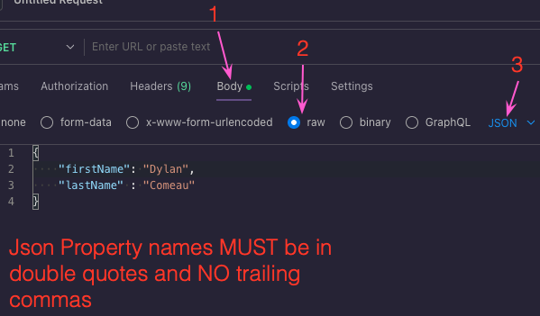

# Restful Servers

## Sending Data in the req body (Postman):

## Guidelines for RESTful APIs:
-   Uniform interface - each doc has its own unique ID, & hataeos OR just good docs (README)
-   Client-Server - separate client vs server (backend vs frontend)
-   Stateless - no data is physically saved on the server & the server will attempt to complete the request it recieves regardless of the data sent with it. May error out.
-   Cacheable - we hate to state whether or not front end is allowed to save our data (being able to save is prefereable & is set by default)
-   Layered System - security layering or proxy server/load balancing layer (more layers between you and the front end).
-   (opt) Code on Demand - sending executable code to help users interact with our API.

## Organizing Code:
-   `express.Router()` - helps separate routes to a new file
-   `router.route()` - combines similare routes